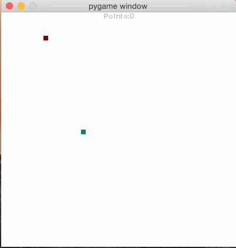

# Introduksjon {.intro}
I denne oppgaven skal vi ta utgangspunkt i et 2D spill, og gjøre noen endringer slik at vi får et spill som vises i 3D i stedet.

# Steg 1: Bli kjent med snake {.activity}


Spillet vi tar utgangspunkt i heter snake. Reglene i snake er ganske enkle og omhandler noen få forskjellige typer objekter.

## Reglene i snake {.check}
+ Slangen. Den som spiller styrer en slange som beveger seg på et brett som er et rutenett.
+ Matbiter. Dette er biter som opptar én enkel rute på brettet og som slangen spiser hvis han er borti. Når slangen spiser en matbit så blir den større og man får poeng.
+ Vegger. Vegger er objekter som slangen dør hvis han berører.
+ Hvis slangen biter seg selv så dør den.
+ Slangen kan bare snu seg 90 grader av gangen.
+ Hvis slangen beveger seg utenfor kanten av brettet så dør den.
+ Målet med spillet er å spise så mange matbiter som mulig før man dør.

Nå som du kan reglene til spillet så kan du prøve det ut litt. Test ut de forskjellige reglene som står over, og bekreft at alt fungerer som det skal.

# Steg 2: Forstå main() {.activity}
Før vi kan begynne å lage vårt eget program hvor snake vises i 3D så må vi forstå hvordan koden til det todimensjonale spillet fungerer.

2dSnake.py består av to hoveddeler. Vi har en klasse som heter Map2D og en funsjon som heter main(). Det er naturlig å starte med funksjonen som heter main, for det er nettopp der programmet starter å kjøre. Hele programmet vårt starter ved at main() blir kjørt, så hvis man forstår main så forstår man i grove trekk hvordan programmet fungerer.

```python
def main():
  map2d = Map2D(50, 50)
  pygame.init()
  surface = pygame.display.set_mode((400, 400))

```
Koden over er de første linjene av main(). Det første som skjer er at det opprettes et nytt brett med 50x50 ruter. Deretter kaller vi på pygame.init() som rett og slett bare er noe vi må gjøre før vi kan bruke pygame. Til slutt oppretter vi et vindu som er 400x400 pixler.

```python
while map2d.running:
  for event in pygame.event.get():
    if event.type == pygame.QUIT:
      pygame.quit()
      quit()
    if event.type == pygame.KEYDOWN:
      if event.key == pygame.K_UP:
        map2d.set_direction(Direction.NORTH)
      elif event.key == pygame.K_DOWN:
        map2d.set_direction(Direction.SOUTH)
      elif event.key == pygame.K_LEFT:
        map2d.set_direction(Direction.WEST)
      elif event.key == pygame.K_RIGHT:
        map2d.set_direction(Direction.EAST)
  map2d.tick()
  map2d.draw(surface)
  pygame.display.flip()
  pygame.time.wait(100)
```

Koden over er den såkalte mainloopen til spillet. Alt som skjer mens vi spiller spillet kan spores tilbake til disse linjene med kode. Som du kan se så er dette en while loop som vil kjøre så lenge map2d.running er sann. Det at map2d.running er sann betyr at vi enda ikke har tapt spillet. Under det følger listen av ting skjer om og om igjen så lenge spillet kjører.

Det første som skjer er at vi går igjennom alle hendelsene som har blitt plukket opp av pygame siden forrige iterasjon av løkken. De eneste hendelsene vi er ute etter er hvor vidt noen har trykket på en av piltastene, eller om noen har krysset ut vinduet. Hvis vinduet har blitt krysset ut så skal programmet stoppes, hvis piltastene har blitt trykket på så skal slangen snus.

Til slutt kommer det som kanskje er det aller mest interessante. Når vi kaller map2d.tick() så sier vi at spillet skal oppdatere spillogikken sin. Når den funksjonen kalles så vil slangen bevege seg i den retningen den skal, hvis den treffer en matbit så vil den bli spist, osv. Deretter kommer den delen av koden som er spesiell for det todimensjonale spillet, nemlig bruken av map2d.draw(surface). Her tegner vi de endringene som nettopp ble gjort av map2d.tick(). For å få det nye bildet vårt over i vinduet så kaller vi på pygame.display.flip(). Til slutt kaller vi pygame.time.wait(100), dette betyr at vi skal vente 0.1 sekunder før vi starter neste iterasjon av mainloopen.


# Forstå Map2D {.activity}
Når vi ser på den første hvor klassen opprettes så ser den slik ut:
```python
class Map2D(Map):
```

Hvis man har vært borti klasser fra før i python så vet man nok omtrent hva denne linjen gjør, den sier at det som kommer i linjene under skal være en del av en klasse som heter Map2D, men hva er betyr det at det står "(Map)"?

Map er en annen klasse som er hentet fra en annen fil. Det er ikke viktig å se på hva som ligger i denne klassen, faktisk så er poenget med denne oppgaven at du skal slippe helt å tenke på det som er i den klassen. Jeg har laget Map ferdig, du som gjør oppgaven skal bare bruke den.

Når vi oppretter Map2D slik vi gjør så sier vi at Map2D er en slags spesialisering av Map, eller for å bruke faguttrykket: Map2D arver fra Map. All logikken som trengs i spillet snake er pakket inn i Map, Map2D er bare en spesialisering som viser spillet på en gitt måte. Hvis du ser etter så ser du at alle metodene i Map2D er relatert til å tegne grafikk, det er ikke noe spillogikk definert her, men siden vi arver fra Map så har den allikevel all spillogikken i seg.

# Kravene til 3D spillet {.activity}
Før vi kan begynne å programmere så må vi vite hva som er kravene til programmet vi skal lage. Når man programmerer så gjør man det veldig ofte for at en eller annen kunde eller bruker skal bli fornøyd. Nå er det jeg som er brukeren deres og dette er min liste med krav.

## Mine krav {.check}
+ I 2D-spillet er alt bygget rundt kvadrater, 3D-spillet skal alt være bygget rundt kuber. Slangen skal være en rekke med kuber, veggene skal også være kuber, og matbitene skal være kuber.

+ Slangen, veggene og matbitene skal alle ha forskjellig farge. Akkurat hvilken farge hver av de skal være er opp til deg, men de må være enkle å skille fra hverandre.

+ Du har ikke lov til å gjøre endringer i den eksisterende koden utover noen få konkrete ting. I stedet for å bruke Map2D så skal du lage din egen klasse som heter Map3D. Map3D skal i likhet med Map2D arve fra Map.

+ Map3D skal ha en funksjon som heter draw_cubes() som kan ta inn en liste med koordinater i spillbrettet og tegne kuber i disse koordinatene.

+ Map3D skal ha en funksjon som kalles fra mainloopen som tegner hele spillbrettet. Det vil si at alle kubene som utgjør slangen, alle veggene og alle matbitene skal tegnes når denne funksjonen blir kalt på.

+ Siden alle objektene i spillet er kuber så er det lurt å ha kode som vi kan gjenbruke for å tegne kuber.


## Hvordan skal
