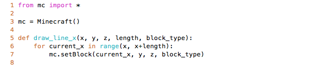
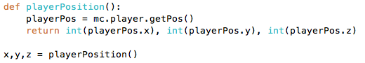
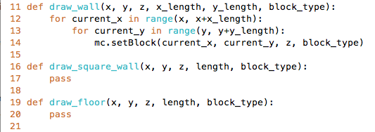
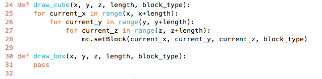
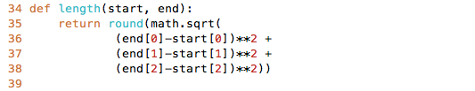
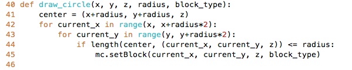
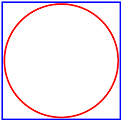

# Introduksjon {.intro}
I denne oppgaven er målet å bli kjent med hvordan vi kan lage geometriske figurer i Minecraft ved hjelp av Python. Vi gjør dette for å til slutt kunne lage et bygg ved hjelp av Python-kode. Vi skal første starte med å lage forskjellige linjer for å bli kjent med x-,y- og z-aksene i Minecraft før vi prøver å lage vegger og gulv. Etter dette skal vi lære å lage sirkler.

Disse oppgavene er basert på en tutorial som er hentet herfra: [Python coding for Minecraft](http://www.instructables.com/id/Python-coding-for-Minecraft/?ALLSTEPS#step1)

# Steg 1: Vi lager linjer langs aksene {.activity}
Vi skal nå lage linjer med blokker i Minecraft ved hjelp av Python.
1. Åpne en text-editor eller IDLE (standard Python-text-editor).
2. Lage en ny fil som heter `mcpipy/line.py`(Dette betyr at line.py ligger i mappen mcpipy).
3. Nå skal vi skrive koden for å lage en linje med blokker fra Minecraft. 

**Linje 1:** vi importerer et bibliotek som heter `mc` som lar oss jobbe med objekter i Minecraft. 

**Linje 3:** Vi lager en instans(variabel) av en klasse som heter Minecraft. Denne skal vi bruke til å sette hvilke blokker vi skal bruke.

**Linje 5:** Her lager vi en funksjon skal skal ta inn x,y,z posisjon, lengde(length) på linja og hvilken blokktype(block_type) vi skal bruke. 

**Linje 6:** Vi lager en for-løkke som går fra x-posisjonen funksjonen vår tar inn og går opp til x-posisjonen + hvor lang vi vil linjen skal være.

**Linje 7:** Vi bestemmer hvor og med hvilken blokktype vi bruker til linjen vi lager. 

4. For å prøvekjøre må du kalle på funksjonen ved å skrive funksjonsnavnet og sette inn tall for paramenterne (x,y,z,length,block_type). Prøv å lag en linje for hver av aksene, x,y og z. 

## Tips {.protip}
For å finne posisjonen til spilleren kan det være lurt å lage en funksjon som returnerer x-,y- og z-verdiene til spilleren. 

# Steg 2: Vi bygger en vegg {.activity}
1. I denne oppgaven skal vi lære å lage vegger og gulv i forskjellige former. Under er koden for å lage en vegg og det er din oppgave å fullføre de to andre funksjonene. `draw_square_wall` skal gjøre det samme som `draw_wall` bare at den kun kan lage kvadratiske vegger. `draw_floor` skal lage et kvadratisk gulv. 

**Linje 11:** `draw_wall` tar inn en x-,y-,z-posisjon, lengden til veggen i x- og y-retning (x_length og y_length), og blokktypen (block_type).

**Linje 12:** Her er det en for-løkke som går bra x-posisjonen som er sendt inn til funksjonen og går x_length steg i x-retning fra x-posisjonen. 

**Linje 13:** Denne linjen gjør akkurat det samme som linje 12, bare i y-retningen. 

**Linje 14:** `mc.setBlock` setter blokken på en gitt posisjon og siden `current_x` øker fra `x` til `x_length`, så vil koden sette blokker hele veien langs x-retningen. Dette gjelder også for `current_y` i y-retning.

## Utfordring: Gjør om `draw_floor` {.challenge}
- Gjør om `draw_floor` sånn at gulvet ikke trenger å være kvadratisk. For å få til dette må du legge til en ekstra parameter, kan du tenkte deg hvilken? 

# Steg 3: Vi lager en boks {.activity}
1. Her er målet å lage en boks. Vi har nå laget en linje og en flate. Som dere kanskje har lagt merke til så har økte vi fra én `for-løkke` til to `for-løkker` når vi gikk fra en linje til en flate. Nå som vi skal lage en kube må vi ha tre `for-løkker`. 
2. Hvis du sitter ved siden av noen, prøv å forklar sidemannen hva koden under gjør og se om dere kan skjønne den sammen. Dersom dere ikke skjønner hva koden gjør, se om dere kan få noen hint fra `Steg 2` eller spør læreren/veilederen din.

3. Nå skal vi programmere selve kuben. Under finner du koden for å lage en kube, det er din oppgave å lage `draw_box` ved hjelp av `draw_cube`. Her er det lurt å ha en ordentlig forståelse av koden til `draw_cube` før du starter.  

# Steg 4: Vi lager en sirkel {.activity}
1. Nå skal vi lage en sirkel. Dette er litt vanskelig matematikk så vi har laget en funksjon for dere som tar inn to punkter og finner lengden mellom dem.  

2. Nå skal vi lage funksjonen `draw_circle`. Her lager vi en variabel `center` som definerer midten av sirkelen. Videre må vi ha to `for-løkker` for å kunne lage blokker i to akser. Det vi egentlig gjør er å lage et kvadrat for så å sjekke om blokkene vi plasserer innenfor den radiusen vi har tatt inn. Dersom den er innenfor radiusen setter vi en blokk. Under vises en sirkel inne i et kvadrat. Det hvite mellom den røde sirkelen og det blå kvadratet blir derfor tomt. Bruk koden under til å se selv.  

