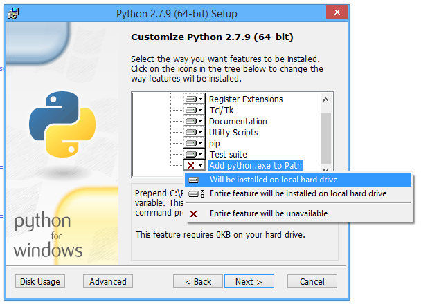

# Introduksjon {.intro}
Dette dokumentet vil forklare hvordan man kan setter opp alt som skal til for å kunne lage egne mods og plugins til Minecraft ved hjelp av Python. For å ta i bruk dette anbefaler vi sterk at brukeren kan endel Python og har erfaring med Minecraft.

Disse oppgavene er basert på en tutorial som er hentet herfra: [Python coding for Minecraft](http://www.instructables.com/id/Python-coding-for-Minecraft/?ALLSTEPS#step1)

# Steg 1: Installer Forge for Minecraft {.activity}
1. For å ta i bruk Forge må vi først ha installert Minecraft. Dette gjøres ved å laste ned [Minecraft](www.minecraft.net). 
2. Viktig at du kjører Minecraft 1.8 én gang før du installerer Forge. Etter å ha kjørt Minecraft 1.8, lukk Minecraft og Minecraft Launcher.
3. Last ned Forge 1.8 (1.8 blank): [Forge](http://files.minecraftforge.net/)
4. Installer Forge med standard instillinger.
5. Start Minecraft og velg Forge-profilen. Denne finner du i rullgardin-menyen nede til venstre. Når du har valgt Forge-profilen skal Minecraft Launchern se ut noe sånn som bilde under. 

# Steg 2: Installere Python {.activity}
Har du Python fra før, så kan du hoppe til `Steg 3`.
1. Hvis du ikke har Python 3, så kan du laste det ned her: [Python](https://www.python.org/downloads/i)
2. Når du installerer Python er det viktig at du trykker på `Customize Python` og huker av `Add python to Path`, dersom du har Windows.  

# Steg 3: Installer mod og skript {.activity}
1. Lag en mappe i Minecraft-mappen som heter `mods`. **Minecraft-mappen for Windows:** Trykk `Windows + R` og skriv `%appdata%\.minecraft` og press enter. **For Mac OS X:** Mappen ligger i `Liberary - Application Support - minecraft`. Dersom du ikke finner denne anbefaler jeg å bruke terminalen ved hjelp av kommandoen `cd ~/Library/Application\ Support/minecraft/` for å flytte deg til minecraft-mappen. `cd` er en kommando som lar deg gå fra mappe til mappe ved å skrive navnet på mappen du vil gå til etter `cd`. Bruk `mkdir mods` for å lage en mappe som heter mods. 

2. Last ned `RaspberryJam-Mod.jar` og `python3-scripts.zip` fra [Github](https://github.com/arpruss/raspberryjammod/releases)
3. Legg `RaspberryJam-Mod.jar` i `mods` mappen du lagde i forrige steg og unzip `python3-scripts.zip` til minecraft-mappen (ikke mods). Denne zip-filen inneholder en mappe som heter `mcpipy`. 

# Steg 4: Prøv en mod {.activity}
1. Start Minecraft.
2. Velg `Forge` profilen.
3. Lag en ny verden, anbefales å gjøre dette i `Creative Mode` med `Superflat`.

4. Trykk på `T` for å åpne kommandolinjen. 
5. Skriv inn `/python donut` for å tegne en stor og fin donut av vann og glass.

Dersom du får feilmeldinger som `Script not found`, så betyr dette at `mcpipy`-mappen ikke ligger der den skal. Den skal ligge i `minecraft`-mappen. 

Dersom du får feilmeldingen `Cannot run program "python"` må du legge til Python til Path. Anbefaler å google dette. 

Dersom du får tegnet en donut, så er alt satt opp! I neste oppgave skal vi se på hvordan vi kan lange linjer og figurer i Minecraft sitt 3D-rom. 
